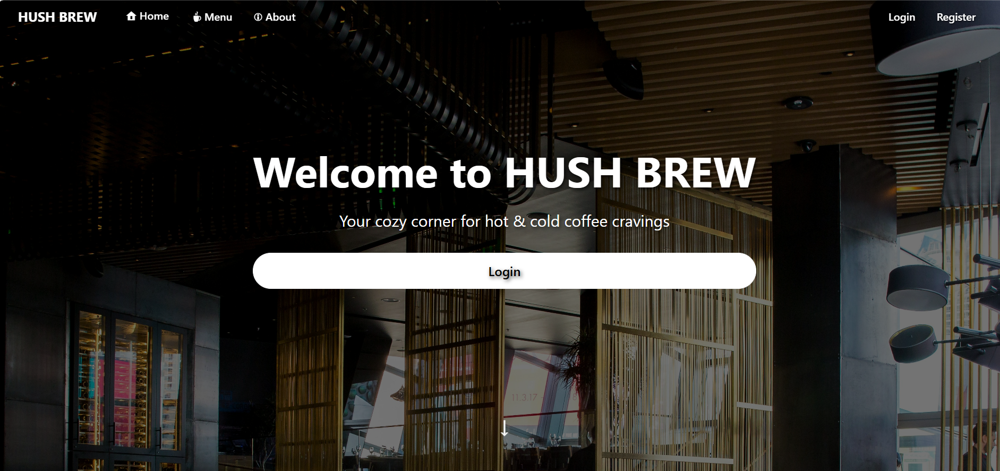
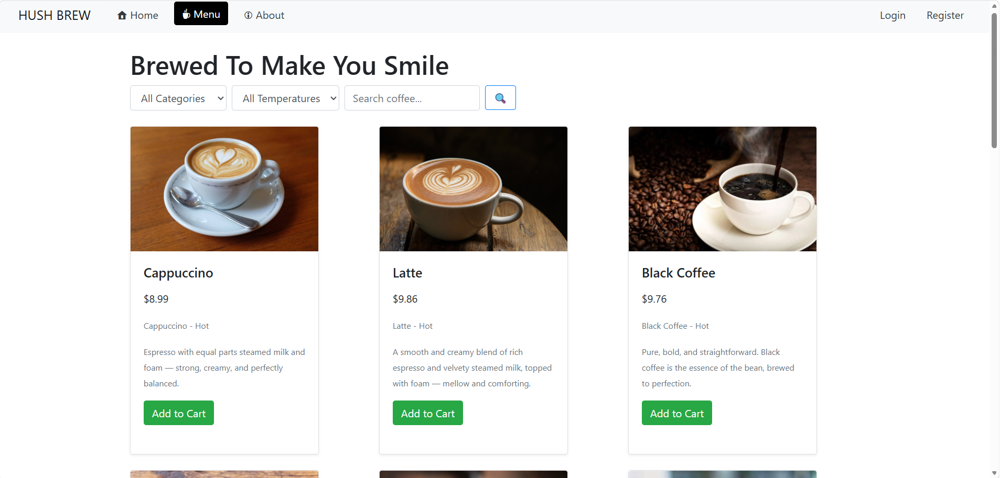
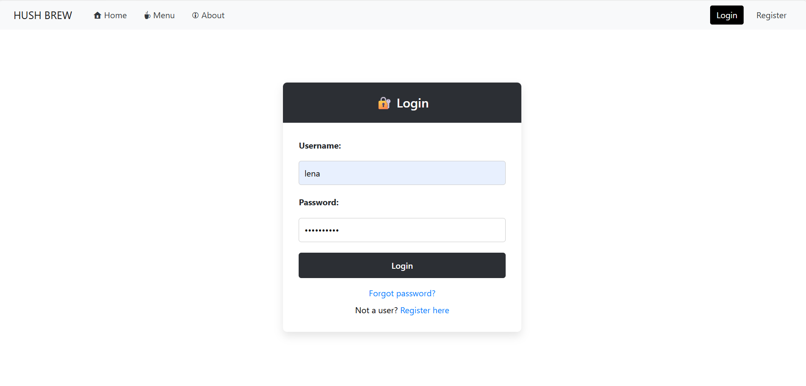
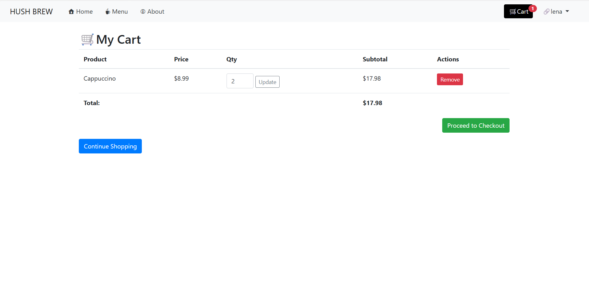
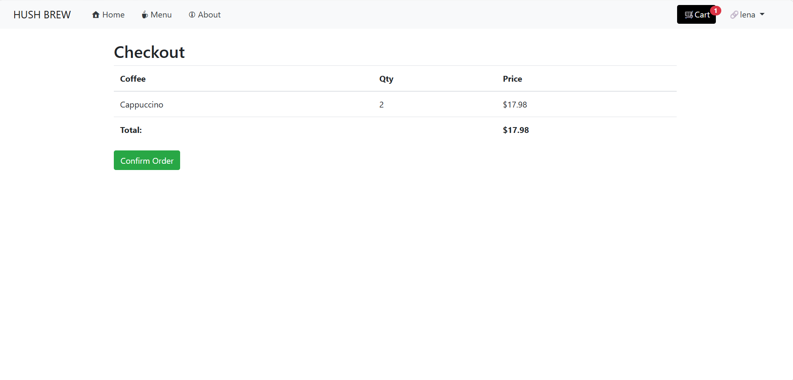
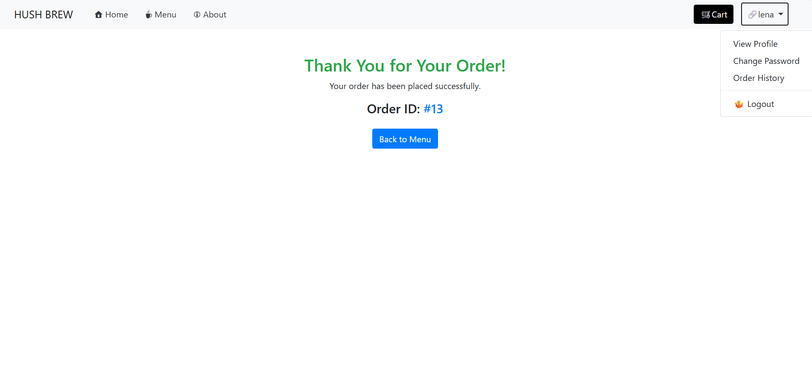
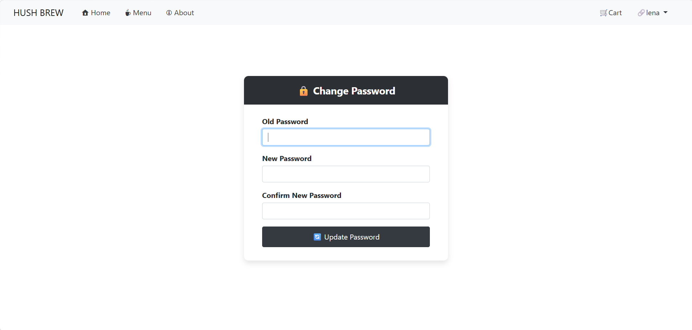

# ☕ HushBrew – Coffee Ordering Website

HushBrew is a modern and responsive coffee ordering web application built using Django.

---

## 🚀 Features

- User Authentication
- Coffee/Product Listing
- Search & Filters
- Cart Functionality
- Checkout and Order Confirmation
- Responsive Design
- Profile Management

---

## 🛠️ Tech Stack

- Django
- Python
- HTML5
- CSS3
- Bootstrap4
- JavaScript
- SQLite3

---

## 📁 Project Architecture

```text
HushBrew-Coffee-Ordering-Website/
│
├── cafe/                         # Main Django project configuration
│   ├── __init__.py
│   ├── asgi.py
│   ├── settings.py
│   ├── urls.py
│   └── wsgi.py
│
├── coffee/                       # Main application
│   ├── migrations/               # Database migrations
│   ├── templates/                # HTML templates
│   ├── templatetags/             # Custom template tags
│   ├── admin.py
│   ├── apps.py
│   ├── forms.py
│   ├── models.py
│   ├── tests.py
│   ├── urls.py
│   └── views.py
│
├── screenshots/                  # README screenshots
│
├── .env                          # Environment variables (not uploaded)
├── .gitignore
├── manage.py
├── README.md
└── requirements.txt
```
---

## 📸 Project Screenshots

### 🏠 Homepage



---

### ☕ Coffee Menu



---

### 🔐 Login Page



---

### 🛒 Cart Page



---

### 🛒 Checkout Page



---

---

### 🛒 Order Confirmed Page



---

---

### 🛒 Change Password Page



---

## ⚙️ Installation & Setup

### Clone Repository

```bash
git clone https://github.com/lenamargretshojo/HushBrew-Coffee-Ordering-Website.git
```

### Navigate to Project Folder

```bash
cd HushBrew-Coffee-Ordering-Website
```

### Install Dependencies

```bash
pip install -r requirements.txt
```

### Run Server

```bash
python manage.py runserver
```

---

## 🌐 Access Website

```text
http://127.0.0.1:8000/
```

---

## 🚧 Future Improvements

- Online Payment Integration
- Order Tracking
- Wishlist Feature
- Product Reviews

---

## 👩‍💻 Author

Lena Margret Shojo

GitHub:
https://github.com/lenamargretshojo